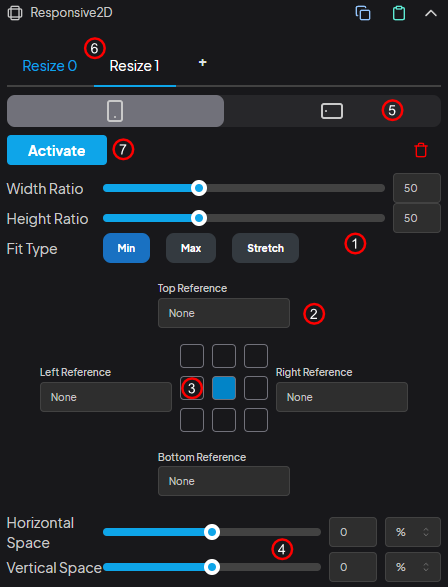

<div class="center-image">
  
</div>

## 1. Scaling

`Width Ratio`, `Height Ratio`, and `Fit Type` are used to size objects according to the parent dimensions. For example, if Width and Height Ratio are set to 50 and Fit Type is set to min, the object will be scaled to 50% of the smaller of the parent’s `baseWidth` and `baseHeight` properties. If max is selected, it will scale according to the larger dimension. Finally, if Stretch is selected, it will stretch to the Width Ratio and Height Ratio values regardless of the min or max settings.

## 2. Reference Node

For example, when talking about `Top Reference`, the top point refers to the top part of the parent. If a different object is selected for Top Reference, this top point will now refer to the bottom of the reference object. To illustrate this with an example, let's say we have an endcard with a logo at the top, text in the middle, and a button at the bottom. If we set the Top Reference of the text object to the logo and the Bottom Reference to the button, the text object will resize according to the space between the other two objects.

## 3. Alignment Boxes

You can use these 9 boxes to adjust the initial positioning of objects. If the box in the top left is selected, the object's initial position will be in the top left.

## 4. Spacing

You can offset the positions of objects using `Horizontal Space` and `Vertical Space`. In the dropdown on the far right, you can change the positioning type to `px`, `%`, or `self`.

#### px

To offset in pixels.

#### %

To offset by a percentage of the parent object.

#### self

To offset by a percentage of the object's own size.

## 5. Landscape Settings

If this tab is not enabled, vertical screen values will also be used for the horizontal screen. The `Copy From Portrait` button at the bottom allows you to copy the values from the vertical screen to the horizontal screen. We include this feature because sometimes there can be very small differences between horizontal and vertical screen values, so you can quickly copy the vertical screen properties to the horizontal screen and easily adjust the horizontal screen properties.

## 6. Multiple Resizes

You can add new resizes by clicking the plus icon. To illustrate this with an example, let's say a logo used in the game is also used in the endcard. While its position might be in the top left corner in the game, it could be in the top center in the endcard. In this case, you can use multi-resize. Another example is if there is a Top Banner in the game; the object might be in one position when the banner is present and in a different position when it's not. This feature can be used in such cases as well.

You can create animated transitions between resizes. To do this:

```js
obj.components.responsive.changeResizeByIndex(1);

// or

obj.components.responsive.changeResizeByIndex(1, {
  duration: 0.6,
  ease: "sine.inOut",
  onComplete: () => {},
  onUpdate: () => {},
  delay: 0,
  repeat: 0,
  yoyo: false,
  repeatDelay: 0,
});

// or

obj.components.responsive.changeResizeByIndex(1, {
  duration: 1,
});
```

In the example above, the object transitions animatedly from the active resize to the resize at index 1.

## 7. Activate Resize
You can set the default resize by clicking this button.