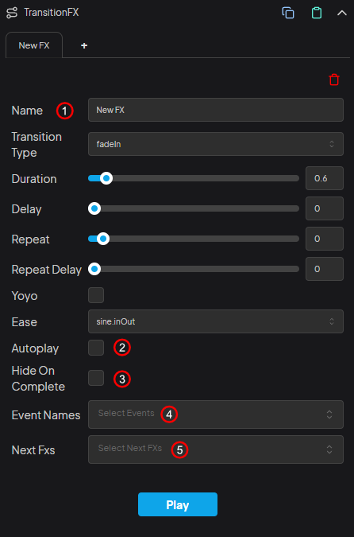

<div class="center-image">
  
</div>

<div class="important-message">
  <span class="danger-badge">Important</span>
  <p>The <strong>TransitionFX</strong> component sets the object's <strong>visible</strong> property to <strong>true</strong> before the animation starts. In some cases, you might not want the object to be visible on the screen before the animation starts; in this case, you can set the object's visible property to false. TransitionFX will automatically set it to true.</p>
</div>

## 1. Transition FX Name

If you want to start the animation with an effect name, you need to specify a name. Otherwise, you can leave it as default.

```js
const fx = obj.components.transitionFX.play("NewFX");

fx.then(() => {
    console.log("Fx is completed.")
});
```

## 2. Autoplay

If you want the animation to start as soon as the object is added to the scene, you can check the autoplay option.

## 3. Hide On Complete

For example, if you create an animation that sets an object's scale property to 0 and this object also has a responsive component, then if this option is not checked, the object will become visible again on the first resize event because it will be resized. If you don't want it to be visible, you should check this option.

## 4. Event Names

In the `settings` menu at the `bottom left of the Studio`, you can add events in the `TransitionFX section` and then use these events `from the component`. For example, let's say we've created a logo and button for an endcard. After preparing the TransitionFX for these objects, we create an event called `endcard` in the TransitionFX menu in the settings. Then, `in the component's Event Names section`, we `select` this `endcard` event. When we emit the event with;

```js
globals.eventEmitter.emit("endcard");
```

the corresponding effects will start playing for both the logo and the button.

## 5. Next Fxs

You can create multiple FXs for objects. If you want one FX to start after another, you can select the next FX from the `Next Fxs` menu.
