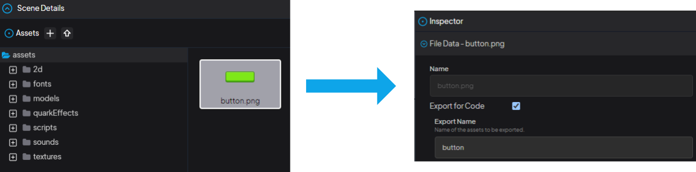

## How To Use An Image Asset?

<div class="center-image">
  
</div>

"Click on the relevant image in the Assets panel, then select the `Export for Code` option from the inspector that opens on the right. Enter the frame name to be used in the template in the `Export Name` field.

```js
const obj = Sprite.from(getTexture2D("button"));
```